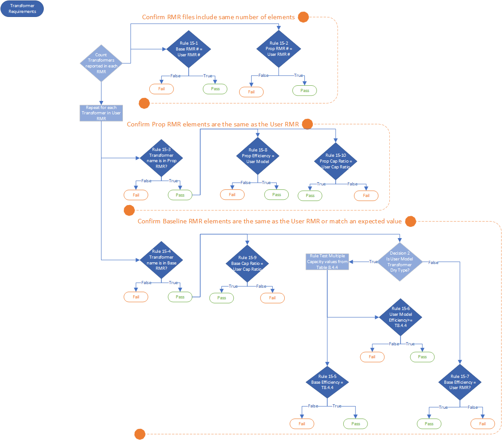

# Transformers - Rule 15-6
**Rule ID:** Rule 15-6  
**Rule Description:** Transformer efficiency reported in User RMR equals Table 8.4.4  
**Rule Assertion:** User RMR = expected value  
**Appendix G Section:** Transformers  
**Appendix G Section Reference:**  Table G3.1 15. Distribution Transformers  
**Data Lookup:** Table 8.4.4  
**Evaluation Context:**  Each Data Element   
**Applicability Checks:**
1. Transformer is DRY_TYPE
2. U_RMR transformer capacity is within range of Table 8.4.4  

**Manual Checks:** None  

## Rule Logic:
- For each transformer `_user_transformer` in `U_RMR.transformers`:
    - Get maximum regulated capacity: `if user_transformer.phase == SINGLE_PHASE: _max_capacity_limit = 333.0 else if user_transformer.phase == THREE_PHASE: _max_capacity_limit = 1000.0`  
    - **Applicability Check 1:** `_user_transformer.type == DRY_TYPE`  
    - **Applicability Check 2:** `_user_transformer.capacity >= 15.0 and _user_transformer.capacity <= _max_capacity_limit:`
    - Get required User transformer efficiency: `required_user_transformer_efficiency = data_lookup(table_8_4_4, _user_transformer.capacity, _user_transformer.phase)`
    - **Rule Assertion:** `user_transformer.efficiency == required_user_transformer_efficiency`

## Diagram

**[Back](../_toc.md)**
